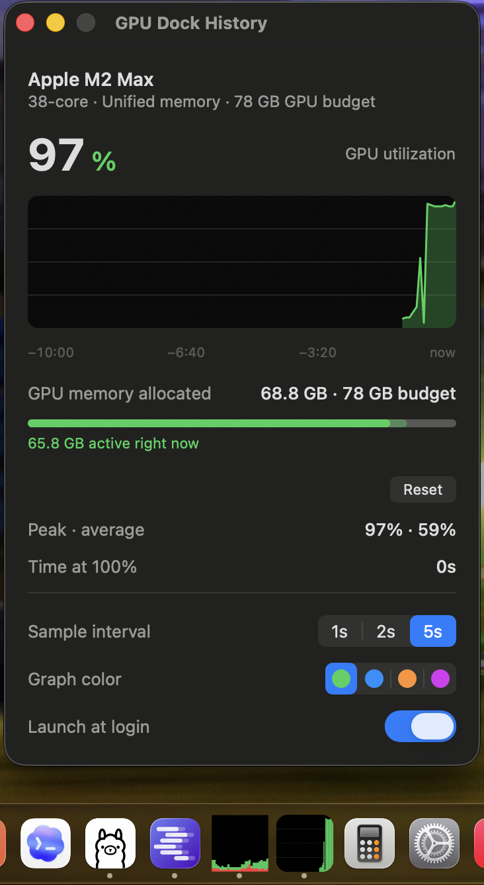

# GPU Dock History

A tiny macOS app whose Dock icon is a live GPU utilization history graph — the GPU equivalent of Activity Monitor's "Show CPU History" dock icon. Built for Apple Silicon. The dock tile is the product; an optional details/settings window is one click away.

Why: Activity Monitor can put **CPU** history in the Dock, but GPU History only exists as a floating window. When doing local LLM/AI work (MLX, Ollama, ComfyUI), a glanceable GPU graph in the Dock alongside the CPU one is what you actually want.



*In the Dock (bottom, the two black graph tiles): Activity Monitor's CPU history on the left, GPU Dock History on its right. Above it, the optional details/settings window under real GPU load: live utilization with a time axis, GPU memory allocated vs. budget with the actively-touched portion highlighted, session peak/average, and settings.*

## How it works

- **Sampling** — reads `Device Utilization %` (plus `Alloc system memory` and `In use system memory`) from the AGX accelerator's `PerformanceStatistics` dictionary in the IORegistry (public IOKit API, no sudo, no kexts). 5s interval by default (matching Activity Monitor's "Normally"), negligible overhead.
- **Display** — a custom `NSView` set as `NSApp.dockTile.contentView`, redrawn each sample: rounded black panel, green bars, 64-sample history, newest at the right.
- **Details window** (optional) — opens on first launch and from the Dock menu (right-click) or the app menu. Shows a larger graph with a time axis, the GPU identity (name, core count, memory budget), a GPU-memory-vs-budget gauge, and peak/average/time-at-100% since Reset. The gauge leads with GPU memory *allocated* — the figure that tells you whether a bigger model or scene will fit; a loaded LLM keeps its weights allocated whether or not it is mid-inference — and shows the memory the GPU is actively touching as a brighter inner segment, which rises during work and falls back within seconds of it finishing. The budget tracks live changes to the GPU wired-memory ceiling (`sudo sysctl iogpu.wired_limit_mb=<mb>`, e.g. to give a local AI model more headroom), marked "(custom)" while an override is active — no relaunch needed. Settings: sample interval (1/2/5s), graph color, and launch-at-login. Window chrome follows the system Light/Dark theme; the graph stays a dark scope. Closing it keeps the app running. A dock-icon click opens the window, raises it if it is buried, and closes it if it is already frontmost.
- **Keyboard** (while the window has focus) — ⌘W close, ⌘M minimize, ⌘H hide, ⇧⌘R reset stats, ⌘Q quit.

## Install

Requires **macOS 13 or later on Apple Silicon**. The app is signed with a
Developer ID certificate and notarized by Apple, so it opens on a normal
double-click — no right-click-Open, no Gatekeeper warning.

> Not yet published — the first release is still pending (see Status). These
> are the commands it will ship with; delete this note when 1.0.0 is out.

**Homebrew** (recommended):

```bash
brew install --cask bbirkinbine/tap/gpu-dock-history
```

**Direct download** — take `GPU-Dock-History-<version>.zip` from
[Releases](https://github.com/bbirkinbine/dock-gpu-history/releases), unzip it,
and drag the app to `/Applications`. Verify it first if you like:

```bash
shasum -a 256 -c GPU-Dock-History-<version>.zip.sha256
```

There is deliberately **no in-app updater** (it would mean a third-party
dependency), so `brew upgrade` is the update path. A hand-downloaded zip has
none at all — prefer Homebrew unless you have a reason not to.

Right-click the Dock icon for the menu, or click it to open the details window.
Toggle **Launch at login** in that window to keep it running across restarts.

Building from source, running the headless verify gate, and cutting a release
are covered in
[docs/ARCHITECTURE.md](docs/ARCHITECTURE.md#building-from-source) and
[docs/RELEASING.md](docs/RELEASING.md).

## Repo layout

```
Sources/GPUDockHistory/   Swift sources (dock tile + optional details window)
Resources/                Info.plist, entitlements, Assets.xcassets (AppIcon)
scripts/                  dev build, release pipeline, verify gate, IOKit key
                          verification, per-process GPU attribution
packaging/                Homebrew cask template (release.sh fills it in)
docs/                     architecture + build instructions, distribution and
                          release guides, GPU tooling survey, screenshots
project.yml               XcodeGen spec (generates the .xcodeproj)
CLAUDE.md                 agent working context/conventions (AGENTS.md points here)
```

## Status

The app is complete and runs daily on an M2 Max — sampling, dock tile, details
window and the release pipeline are all done and verified on hardware.

**Not yet shipped.** `1.0.0` is built, signed and notarized, but the git tag,
GitHub Release and Homebrew cask are still pending. The Mac App Store is a
separate, later step — see [docs/DISTRIBUTION.md](docs/DISTRIBUTION.md).

## License

MIT

## Acknowledgements

This project was developed with the assistance of AI tools.
