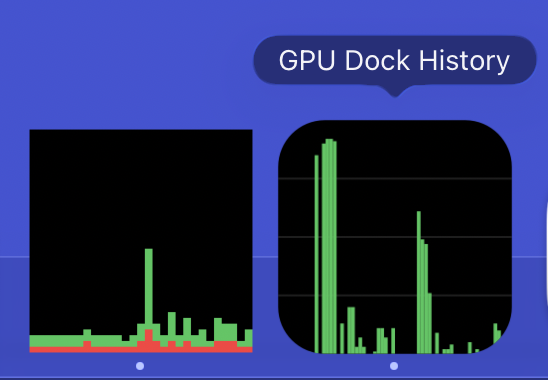

# GPU Dock History

A tiny macOS app whose Dock icon is a live GPU utilization history graph — the GPU equivalent of Activity Monitor's "Show CPU History" dock icon. Built for Apple Silicon. The dock tile is the product; an optional details/settings window is one click away.

Why: Activity Monitor can put **CPU** history in the Dock, but GPU History only exists as a floating window. When doing local LLM/AI work (MLX, Ollama, ComfyUI), a glanceable GPU graph in the Dock alongside the CPU one is what you actually want.



*Installed: Activity Monitor's CPU history (left) and GPU Dock History (right), side by side in the Dock.*

## How it works

- **Sampling** — reads `Device Utilization %` (and `In use system memory`) from the AGX accelerator's `PerformanceStatistics` dictionary in the IORegistry (public IOKit API, no sudo, no kexts). 1s interval by default, negligible overhead.
- **Display** — a custom `NSView` set as `NSApp.dockTile.contentView`, redrawn each sample: rounded black panel, green bars, 64-sample history, newest at the right.
- **Details window** (optional) — opens on first launch and from the Dock menu (right-click) or the app menu. Shows a larger graph with a time axis, the GPU identity (name, core count, memory budget), a GPU-memory-vs-budget gauge, and peak/average/time-at-100% since Reset. Settings: sample interval (1/2/5s), graph color, and launch-at-login. Window chrome follows the system Light/Dark theme; the graph stays a dark scope. Closing it keeps the app running.

## Quick start (dev build, no Xcode project)

```bash
./scripts/build.sh
open "build/GPU Dock History.app"
```

Requires Xcode Command Line Tools. Right-click the dock icon → Quit to stop, or Open GPU Dock History for the details window. Toggle **Launch at login** in that window (or add it to System Settings → General → Login Items) to keep it running.

`build.sh` compiles with `swiftc` and no `-target` flag, so it builds for the host architecture only — on Apple Silicon that is an **arm64-only** binary, which won't launch on Intel Macs. This is intentional: the app is Apple-Silicon-only (see [docs/ARCHITECTURE.md](docs/ARCHITECTURE.md#platform--build-architecture)).

`./scripts/verify.sh` builds and checks the sampling pipeline headlessly (`gpudockhistory --sample` prints utilization values without starting the app). If the graph stays flat under GPU load, run `./scripts/verify-iokit-key.sh`.

## Xcode / App Store build

The Xcode project is generated from `project.yml` via [XcodeGen](https://github.com/yonaskolb/XcodeGen):

```bash
brew install xcodegen
xcodegen generate
open GPUDockHistory.xcodeproj
```

See `docs/APP_STORE_PUBLISHING.md` for the full path to Mac App Store submission.

## Repo layout

```
Sources/GPUDockHistory/   Swift sources (dock tile + optional details window)
Resources/                Info.plist, entitlements, Assets.xcassets (AppIcon)
scripts/                  dev build, verify gate, IOKit key verification
docs/                     architecture, App Store publishing guide, screenshot
project.yml               XcodeGen spec (generates the .xcodeproj)
HANDOFF.md                handoff brief / task checklist for agent sessions
CLAUDE.md                 agent working context/conventions (AGENTS.md points here)
```

## Status

- [x] Core app written (sampler, dock tile view, app shell)
- [x] Verified on hardware (M2 Max): IOKit key present, builds, runs, sampler returns real values
- [x] Agentic loop ported from `agentic-scaffold` — see CLAUDE.md
- [x] Visual polish confirmed under GPU load — no flicker, ~0% CPU idle, matches Activity Monitor sitting beside it
- [x] App icon (full AppIcon.appiconset) + privacy/store draft copy
- [x] Optional details/settings window (App Review 4.2 mitigation) — compiles + headless verify passes; window rendering pending a visual check
- [ ] Sandbox verification for MAS

## License

MIT

## Acknowledgements

This project was developed with the assistance of AI tools.
